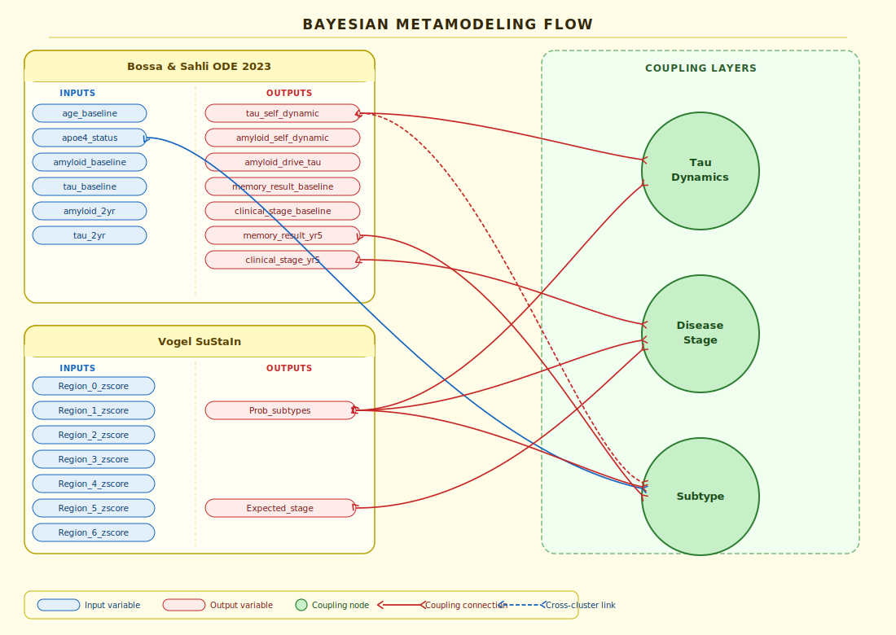

# Metamodel Coupling: Bossa & Sahli ODE and Vogel's SuStaIn

This directory contains the specification files and execution scripts for probabilistically coupling the Bossa & Sahli's ODE temporal model with Vogel's SuStaIn spatial model using the Bayesian Metamodeling Framework.

## Surrogate Models I/O Specifications

Before understanding the coupling mechanics, it is crucial to know the inputs and outputs of the two independent surrogate models being coupled:

### 1. ODE Surrogate Model (Temporal Decline)
| Category | Variables |
| :--- | :--- |
| **Inputs** | `age_baseline`, `apoe4_status`, `amyloid_baseline`, `tau_baseline`, `amyloid_2yr`, `tau_2yr` |
| **Outputs** | `tau_self_dynamic` (intrinsic ODE kinetic rate parameter for tau), `amyloid_self_dynamic` (intrinsic ODE kinetic rate parameter for amyloid), `amyloid_drive_tau` (ODE interaction coefficient), `memory_cognitive_test_result` (clinical memory score), `clinical_stage` (overall decline severity 0-2) |

### 2. SuStaIn Surrogate Model (Spatial Biomarker Progression)
| Category | Variables |
| :--- | :--- |
| **Inputs** | `region_0_zscore`, `region_1_zscore`, `region_2_zscore`, `region_3_zscore`, `region_4_zscore`, `region_5_zscore`, `region_6_zscore` |
| **Outputs** | `prob_subtype_0`, `prob_subtype_1`, `prob_subtype_2` (trajectory probabilities), `expected_stage` (overall accumulating count of biomarker events 0-21) |

---

## File Map

- **`build_coupling.py`**: The primary script that defines the structural coupling specifications (JSON) and executes the Bayesian metamodeling compiler to build and cache the PyMC models for various time horizons (`dt`).
- **`evaluate_coupling_patient.py`**: An execution script that loads a pre-compiled coupling JSON spec, accepts mock patient data, and runs NUTS MCMC sampling to generate a personalized patient forecast, saving output visualizations to the project root and `scratch/`.
- **[Coupling_Test.md](/Coupling/Coupling_Test.md)**: A test specification detailing the patient archetypes (Subject 1: Conflict, Subject 2: Amplification) used to verify and staging-test the mathematical compromise/reinforcement of the coupled system.
- **`coupling_specs/`**: The generated `metamodel_coupling_dt*.json` schema files produced by `build_coupling.py`.
- **`scratch/`**: Output directory for generated visualizations, test scripts, and temporary patient specs.
- **`patient_coupling_evaluation.png`**: The comparative plot visual showing uncoupled vs coupled joint posterior distributions for the test subjects.

---

## Architecture & Process Overview

The framework creates a joint posterior over the two independent surrogate models by explicitly linking specific variables with `gaussian_link` noise models. During MCMC sampling (via PyMC), the solver adjusts the internal latent parameters of both models until they reach an agreement guided by these soft constraints.

> [!CAUTION]
> **Baseline Sampling Engine Limitation (Post-Draw Approximation)**:
> In the framework's baseline sampler (`bayesian_metamodeling/meta/sampling.py`), coupling is **not** resolved as a true joint posterior. Instead, the engine draws independent random samples from the source priors, runs them forward through the transform, and then **completely overwrites the target variables** with the transformed value plus noise.
>
> Consequently, the target variable's own prior distributions and uncoupled surrogate predictions are **entirely ignored** during sampling. It functions as a forward simulation mapping rather than true joint probabilistic constraint resolution.

We bridged the two models across three core domains using custom mathematical transformations (detailed in `bayesian_metamodeling_architectural_flow_updated`).

### 1. Subtype-Driven Velocity / Tau Dynamics
- **Coupled Variables**:
  - **Source (SuStaIn)**: `prob_subtype_0`, `prob_subtype_1`, `prob_subtype_2`
  - **Target (ODE)**: `tau_self_dynamic`
- **The Logic (The "Rubber Band")**: The ODE's internal biological rate constant (`tau_self_dynamic`) defines the trajectory's underlying kinetic velocity. Because this is an intrinsic rate parameter, it remains constant across the patient's lifetime. However, a patient's **SuStaIn Subtype** directly dictates what this intrinsic rate should be. Atypical patients ($P_0, P_2$) spread tau aggressively into the neocortex (high ceiling, fast kinetics), while Limbic patients ($P_1$) plateau early in the medial temporal lobe (low ceiling, slow kinetics). 
  We use a Bayesian **Directional Potential** to apply a "statistical wind" to the ODE's naturally predicted velocity without forcing a hardcoded absolute number. If the patient leans Atypical, the sampler receives a log-probability bonus for exploring higher kinetic rates (stretching the ODE's mathematical rubber band until the internal ODE physics penalty snaps it back).
- **Mathematical Formula (Transform)**:
  First, a `velocity_modifier_score` transform generates the "wind score" ($S$) using a dot product of the Subtype probabilities ($P$) and empirically chosen speed weights ($W$):
  $$ S = \sum_{i=0}^{N-1} (P_i \times W_i) $$
  For our specific mapping, we use:
  $$ S = (P_0 \times 1.0) + (P_1 \times -0.3) + (P_2 \times 0.5) $$
  *(Notice how the Classic Limbic subtype $P_1$ receives a negative weight, explicitly pushing its intrinsic velocity down to simulate the biological plateau).*
- **Mathematical Formula (Directional Potential)**:
  The `directional_potential` coupling constraint then applies this score as a direct penalty/bonus to the PyMC Log-Probability landscape during sampling:
  $$ \text{Log-Probability\_Bonus} = \sigma \times \Big( \text{tau\_self\_dynamic} \times S \Big) $$
  *(Where $\sigma$ is the tuning parameter for the strength of the "wind").*

---

### 2. Disease Stage
- **Coupled Variables**:
  - **Sources (SuStaIn)**: `expected_stage` dynamically weighted by `prob_subtype_0`, `prob_subtype_1`, `prob_subtype_2`
  - **Target (ODE)**: `clinical_stage`
- **The Logic**: The ODE model tracks stages continuously (CN $\to$ MCI $\to$ Dementia on a 0.0-2.0 scale). SuStaIn tracks spatial events discretely (0-21). We use a **sustain_to_ode_stage Mapper** to translate the 0-21 spatial event score into an expected 0.0-2.0 clinical score. Because different subtypes experience cognitive failure at entirely different spatial burdens (e.g., Atypical patients suffer massive cortical damage before clinical memory failure, while Limbic suffers early memory loss), this mapping is not universal. It interpolates between multiple logistic progression curves based on the patient's predicted SuStaIn subtype probabilities.
- **Mathematical Formula**: 
  Let $x$ be the SuStaIn `expected_stage`. We define two logistic progression curves targeting a max clinical severity of 2.0:
  
  **Curve Limbic (Subtype 1):** Rises quickly at lower stages (midpoint anchor 10.0).
  $$ C_{Limbic}(x) = \frac{2.0}{1 + e^{-0.4(x - 10.0)}} $$
  
  **Curve Atypical (Subtypes 0 and 2):** Rises slower, reaching dementia at higher stages (midpoint anchor 15.0).
  $$ C_{Atypical}(x) = \frac{2.0}{1 + e^{-0.4(x - 15.0)}} $$
  
  The final expected clinical stage is a weighted interpolation:
  $$ \text{Expected Clinical Stage} = \Big[ P(\text{Subtype}_1) \cdot C_{Limbic}(x) \Big] + \Big[ (P(\text{Subtype}_0) + P(\text{Subtype}_2)) \cdot C_{Atypical}(x) \Big] $$
- **⚠️ PLACEHOLDER WARNING / DISCLAIMER**: The midpoint anchors (10.0 for Limbic, 15.0 for Atypical) are pure heuristics. Crucially, they are **highly dependent on the total number of SuStaIn stages and regions** (here assumed to be 21). If the number of stages changes, these anchors MUST be empirically recalibrated against real clinical data.

### 3. Subtype Prior
- **Coupled Variables**:
  - **Sources (ODE)**: `apoe4_status`, `tau_self_dynamic`, `tau_baseline` (passed but ignored), `memory_cognitive_test_result`
  - **Targets (SuStaIn)**: `prob_subtype_0`, `prob_subtype_1`, `prob_subtype_2`
- **The Logic**: SuStaIn predicts subtypes purely based on brain scans, but we want to incorporate the patient's longitudinal clinical history as a prior. The **clinical_subtype_scorer** transform synthesizes "Limbic" vs "Neocortical" scores using known empirical associations (e.g., APOE4+ heavily favors Limbic, rapid decline and severe memory deficits favor Atypical/Neocortical). These scores are passed through a Softmax function to generate a probability distribution that acts as a soft constraint on the SuStaIn model's own subtype predictions.
- **Mathematical Formula**:
  First, we map the continuous velocity $V$ (`tau_self_dynamic`) asymptotically to $[0, 1)$:
  $$ V_{norm} = 1 - e^{-V} $$
  Next, we clip the memory test score $M$ (`memory_cognitive_test_result`) to ensure it stays within $[0, 1]$ bounds:
  $$ M_{norm} = \text{clip}(M, 0.0, 1.0) $$
  Then, using $A$ (`apoe4_status`), we calculate symmetric propensity scores for Limbic and Neocortical phenotypes:
  $$ S_{limbic} = A + (1 - V_{norm}) + M_{norm} $$
  $$ S_{neo} = (1 - A) + V_{norm} + (1 - M_{norm}) $$
  
  **Biological Rationale for the Formulas:**
  To make this intuitive for researchers unfamiliar with Alzheimer's subtypes:
  - **Memory ($M_{norm}$):** A high memory test score means *worse* memory. Because the Limbic subtype specifically damages the memory centers (hippocampus) very early, severe memory loss adds directly to the Limbic score ($+M_{norm}$). If memory is well-preserved (a low score, yielding a high $1 - M_{norm}$), it favors the Atypical/Neocortical pathways, where patients often suffer language or visuospatial failure before memory loss.
  - **Tau Velocity ($V_{norm}$):** Atypical variants are generally more aggressive and spread tau rapidly across the cortex (high velocity). Thus, high velocity adds directly to the Neocortical score ($+V_{norm}$). The classic Limbic presentation often has a lower, plateauing kinetic rate ($1 - V_{norm}$).
  - **Genetics ($A$):** Being a carrier of the APOE4 gene ($A = 1$) is overwhelmingly associated with the classic, memory-first Alzheimer's presentation. Thus, APOE4 positivity directly boosts the Limbic score ($+A$), while non-carriers ($1 - A$) receive a boost toward Neocortical.

  We then construct the raw score array mapping to the specific SuStaIn subtypes (Subtype 0 and 2 are Atypical/Neocortical, Subtype 1 is Limbic):
  $$ \text{Raw Scores} = [S_{neo}, S_{limbic}, S_{neo}] $$
  Finally, a Temperature-Scaled Softmax generates the target probabilities:
  $$ P(\text{Subtype}_i) = \frac{\exp(\beta \cdot \text{Raw Scores}[i])}{\sum_{j=0}^{2} \exp(\beta \cdot \text{Raw Scores}[j])} $$
- **⚠️ TUNNING REQUIRED**: The softmax temperature (`beta=1.0`) and the gaussian constraint variance (`sigma=0.25`) are currently placeholders. If the prior is too strong (the sampler ignores the brain scan), $\sigma$ must be relaxed or $\beta$ decreased. **We must tune these hyperparameters empirically using a real dataset of patients with both clinical history and brain scans. The same goes for how we weighted the variables to calculate the raw scores**

---

## External Framework Modifications

To support the custom couplings detailed above, we extended the core `bayesian_metamodeling` framework codebase. The custom mathematical transformations and constraint types were integrated directly into the framework's `compiler.py` and `sampling.py`.

### Subtype-Driven Velocity
- **`ir.py`**: Added `directional_potential` to the valid `coupling_type` schema definitions for the intermediate representation.
- **`compiler.py`**: Added the `directional_potential` coupling type, which bypasses the standard Gaussian residual subtraction and injects direct log-probability rewards into the PyMC state graph.
- **`sampling.py`**: Added the `velocity_modifier_score` mathematical transform function. This calculates the dot product using dynamic arrays (`sum(P_i * W_i)`), ensuring it remains future-proof regardless of how many subtypes SuStaIn discovers in future datasets.

### Disease Stage
- **`compiler.py` & `sampling.py`**: Added the `sustain_to_ode_stage` mathematical transform function. This evaluates the subtype-conditioned logistic curves to dynamically map the continuous SuStaIn spatial stage into an expected continuous ODE clinical severity score.

### Subtype Prior
- **`compiler.py` & `sampling.py`**: Added the `clinical_subtype_scorer` mathematical transform function. This generates symmetric propensity scores from APOE4 status, cognitive scores, and predicted kinetic velocity, passing them through a temperature-scaled Softmax to output a probability distribution.

---

## Predicting a Specific Patient

Because the coupling framework does not need to be "trained", predicting a specific new patient's future is as simple as constraining the system with their known clinical markers before running the sampler.

**Process:**
1. **Pin the Patient's Data in the JSON**: Open your `metamodel_coupling.json` file. Change the generic `priors` for the variables you know, giving them the patient's exact values with a tiny `scale` (which tells the math engine you are 100% certain about this number).
2. **Run the Sampler**: Execute the engine: `bayesmm meta sample C:/Project/Coupling/metamodel_coupling_dt5.json --draws 1000`
3. **What Happens (The MCMC Process)**: The engine explores virtual futures, naturally spending its time proportionally sampling a "cloud" of plausible trajectories where the ODE and SuStaIn models mathematically agree within the tolerance of your $\sigma$ variances.
4. **Read the Prediction**: The surviving virtual futures are saved in `samples_dataset.json`. Unpinned variables (like future clinical stages or regional tau distributions) will represent the personalized, consensus forecast for that patient.
